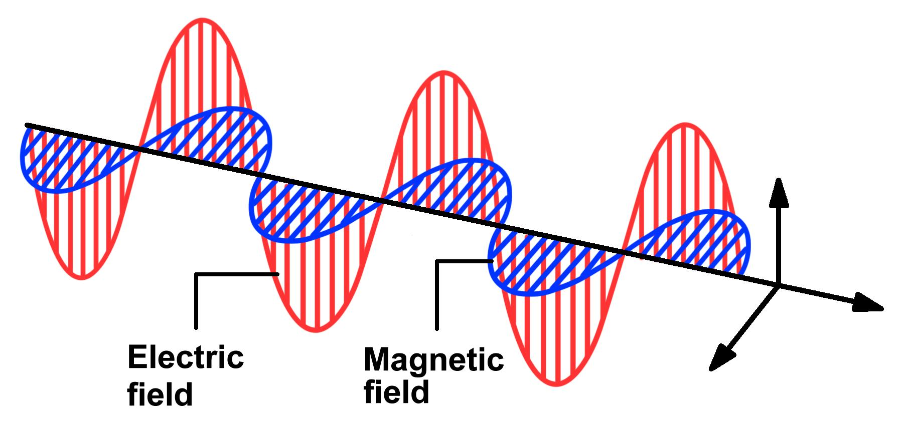

<!-- PROJECT LOGO -->
 

  

 
 

<!-- BACKGROUND & TITLE -->

  
  <h3 align="center">Electricity & Magnetism</h3>
 

<!-- TABLE OF CONTENTS -->
## Table of Contents

* [**Notes**](https://github.com/MDBrodskiy/Electricity_Magnetism/tree/master/Notes/)
  * [**Vector Calculus**](https://github.com/MDBrodskiy/Electricity_Magnetism/tree/master/Notes/Section1.pdf)
  * [**Electrostatics**](https://github.com/MDBrodskiy/Electricity_Magnetism/tree/master/Notes/Section2.pdf)
  * [**Potentials**](https://github.com/MDBrodskiy/Electricity_Magnetism/tree/master/Notes/Section3.pdf)
  * [**Electric Fields in Matter**](https://github.com/MDBrodskiy/Electricity_Magnetism/tree/master/Notes/Section4.pdf)
  * [**Magnetostatics**](https://github.com/MDBrodskiy/Electricity_Magnetism/tree/master/Notes/Section5.pdf)
  * [**Magnetic Fields in Matter**](https://github.com/MDBrodskiy/Electricity_Magnetism/tree/master/Notes/Section6.pdf)
  * [**Electrodynamics**](https://github.com/MDBrodskiy/Electricity_Magnetism/tree/master/Notes/Section7.pdf)
  * [**Electromagnetic Waves**](https://github.com/MDBrodskiy/Electricity_Magnetism/tree/master/Notes/Section8.pdf)
  * [**Potentials and Fields**](https://github.com/MDBrodskiy/Electricity_Magnetism/tree/master/Notes/Section9.pdf)
* [**Homework**](https://github.com/MDBrodskiy/Electricity_Magnetism/tree/master/Homework/)
  * [**Homework 1**](https://github.com/MDBrodskiy/Electricity_Magnetism/tree/master/Homework/Homework1.pdf)
  * [**Homework 2**](https://github.com/MDBrodskiy/Electricity_Magnetism/tree/master/Homework/Homework2.pdf)
  * [**Homework 3**](https://github.com/MDBrodskiy/Electricity_Magnetism/tree/master/Homework/Homework3.pdf)
  * [**Homework 4**](https://github.com/MDBrodskiy/Electricity_Magnetism/tree/master/Homework/Homework4.pdf)
  * [**Homework 5**](https://github.com/MDBrodskiy/Electricity_Magnetism/tree/master/Homework/Homework5.pdf)
  * [**Homework 6**](https://github.com/MDBrodskiy/Electricity_Magnetism/tree/master/Homework/Homework6.pdf)
  * [**Homework 7**](https://github.com/MDBrodskiy/Electricity_Magnetism/tree/master/Homework/Homework7.pdf)
  * [**Homework 8**](https://github.com/MDBrodskiy/Electricity_Magnetism/tree/master/Homework/Homework8.pdf)
* [**Exams**](https://github.com/MDBrodskiy/Electricity_Magnetism/tree/master/Exams/)

<!--
  * [**Chapter 1**](#Notes/Chapter\ 1)
* [**Exams**](#Exams)
* [**Projects**](#Projects)
-->

An assortment of lecture notes and exams from Northeastern University's PHYS3602 (Fall 2023)
    
Open sourced **LaTeX** Templates [here](https://www.latextemplates.com/).
 
**TikZ** diagram editor [here](https://www.mathcha.io/editor).
 
**TikZ** examples [here](https://www.texample.net/tikz/example).
 
**LaTeX** draw [here](https://www.latexdraw.com/).
     
Authentication:   
    <pre>to receive commit access to this repository e-mail Michael@Brodskiy.com for credential verification/authorization</pre>

Cloning This Repository
 &nbsp;&nbsp;with **command line interface**:
    <pre>    
    **$** git clone https://github.com/MDBrodskiy/Electricity_Magnetism.git    
    **$** **>**  **_**
    </pre>
